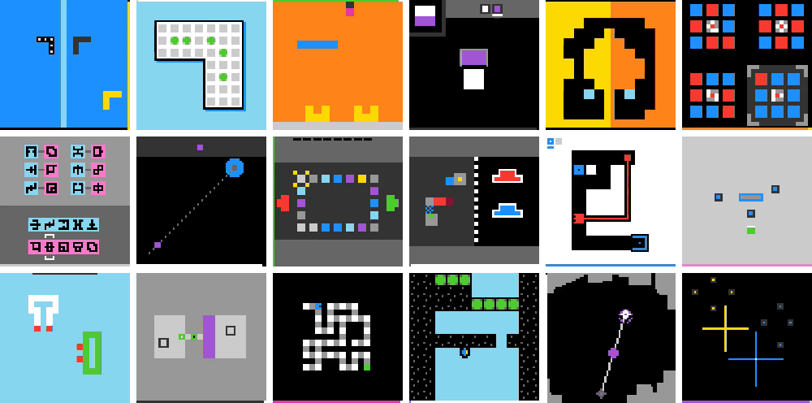

<h2 align="center">VISTA: A Visual Harness for Reasoning in an Interactive World</h2>

<p align="center">
  Qiushi Han* &nbsp;&middot;&nbsp; Keya Hu* &nbsp;&middot;&nbsp; Linlu Qiu* &nbsp;&middot;&nbsp; Cathy Wu &nbsp;&middot;&nbsp; Kaiming He
  <br>
  Massachusetts Institute of Technology
  <br>
  <sub>* co-leads</sub>
</p>

<p align="center">
  <a href="https://vista-research.github.io/">Blog post</a>
</p>

<p align="center">
  
</p>

VISTA gives general-purpose multimodal models a continuous visual interface to
interactive environments. It preserves environment frames as visual memory so
the agent can revisit original evidence while reasoning and acting over long
horizons.

With Claude Opus 5.0, VISTA completes all 25 public ARC-AGI-3 games with a 100%
win rate and a Relative Human Action Efficiency (RHAE) score of 100.

Scorecards:

| Runtime | Model | Effort | RHAE |
| --- | --- | --- | ---: |
| Codex CLI | GPT-5.6 Sol | max | [99](https://arcprize.org/scorecards/abda28e2-d605-4e81-9efc-cf63dda06df5) |
| Claude Code | Opus 5.0 | xhigh | [100](https://arcprize.org/scorecards/39be671a-d0cc-48b4-ae08-1db4abc44c83) |

## Interface

```text
observe the current visual
-> reason and use memory as needed
-> execute one game action
-> observe the resulting visual
```

Every environment frame is archived. The final frame becomes the current
observation, and earlier final or animation frames remain available through
visual memory.

Player instructions:

```text
# Visual game task

Complete the game with as few game actions as possible.

Build and use a compact, revisable model of the game and its current state. Update it as new evidence changes what is supported.

Before each `play`, briefly state what you expect to see. Afterward, briefly state all visible changes, expected or not.

Keep concise, durable, revisable game understanding in `GUIDE.md`; use `WORKING.md` as a scratchpad when useful.
```

Available tools:

- use `play` to execute a game action;
- use `inspect` to revisit selected visual frames and regions;
- use `read_pixels` to sample exact colors from selected image regions;
- use `history` to revisit prior actions and environment results;
- use `GUIDE.md` and `WORKING.md` for persistent and working memory.

## Setup

VISTA runs on Linux x86_64 with Python 3.12+, Docker Engine, and either
Codex CLI 0.145.0 or Claude Code 2.1.220. Online and competition runs require
an ARC-AGI-3 API key.

From a repository checkout, install the Python package:

```bash
python3 -m venv .venv
.venv/bin/python -m pip install --upgrade pip
.venv/bin/python -m pip install -e .
cp .env.example .env
chmod 600 .env
```

Sign in to the [ARC Prize platform](https://arcprize.org/platform), create a key
under your profile's **API Keys**, and add it to `.env`:

```dotenv
ARC_API_KEY=your-key
ARC_BASE_URL=https://three.arcprize.org
```

### Codex CLI

```bash
npm install --prefix ~/.local/share/arc3-codex/0.145.0 \
  --omit=dev --no-audit --no-fund @openai/codex@0.145.0
~/.local/share/arc3-codex/0.145.0/node_modules/.bin/codex login
```

### Claude Code

```bash
curl -fsSL https://claude.ai/install.sh | bash -s 2.1.220
~/.local/share/claude/versions/2.1.220 setup-token
```

Add the generated token to `.env`:

```dotenv
CLAUDE_CODE_OAUTH_TOKEN=your-token
```

### Docker

Build the image for the runtime you will use:

```bash
# Codex CLI
docker build -t arc3-codex-player:0.1 -f Dockerfile.codex-player .

# Claude Code
docker build -t arc3-claude-player:0.1 -f Dockerfile.claude-player .
```

## Run

Run one game with Codex:

```bash
.venv/bin/python scripts/run_arc3_codex.py \
  --game-id s5i5 \
  --model gpt-5.6-sol \
  --effort max
```

Run one game with Claude:

```bash
.venv/bin/python scripts/run_arc3_claude.py \
  --game-id s5i5 \
  --model opus \
  --effort xhigh
```

Run all games:

```bash
./scripts/run_batch.sh --runtime codex --mode online \
  --model gpt-5.6-sol --effort max -j 2
./scripts/run_batch.sh --runtime claude --mode online \
  --model opus --effort xhigh -j 2
```

Available modes are `online` and `competition`. `offline` is also available when
local game files are supplied through `ENVIRONMENTS_DIR`.

## Citation

```bibtex
@misc{han2026vista,
  title  = {{VISTA}: A Visual Harness for Reasoning in an Interactive World},
  author = {Han, Qiushi and Hu, Keya and Qiu, Linlu and Wu, Cathy and He, Kaiming},
  year   = {2026},
  month  = aug,
  note   = {Blog post},
  url    = {https://vista-research.github.io/}
}
```
